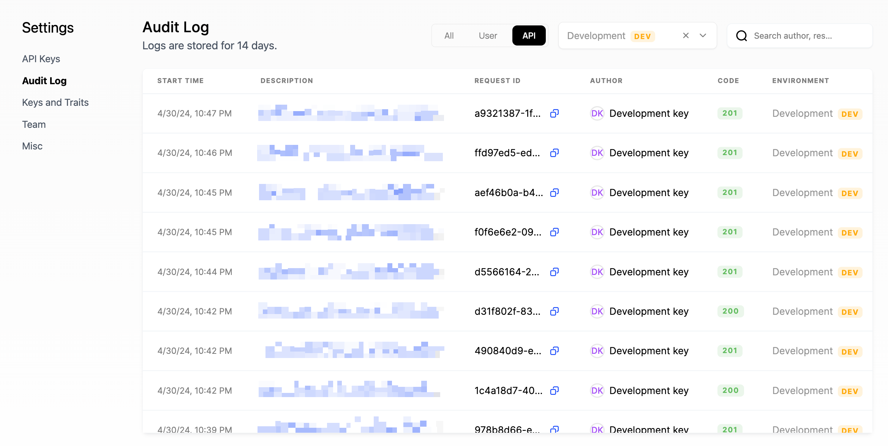

## Concepts

### User and company profiles

Schematic logs all traits and events submitted via the API or client libraries, as well as data synced from third party tools such as Stripe. You can use this data to construct rules for feature targeting within Schematic.

Because Schematic creates and updates user and company profiles by storing context and usage data from your application and business tools, it is not necessary to pass additional context when initializing an SDK.

### Keys vs. traits

Schematic uses **keys** as a unique identifier for companies and users. You can store any number of keys, however keys must be unique between each user and each company, respectively. For example, you may have a Stripe Customer ID, a Salesforce Account ID, and an application ID that correspond to an individual company. Each can be stored as separate keys that can be referenced by any tool interacting with Schematic.

**Traits** are pieces of information you may know about a user, a company, or an event. This could be metadata such as start date, renewal date, industry, employees, or role. This could also be data relevant to usage-based limits, like number of seats in use.

SDKs can reference companies or users by their Schematic ID using the `id` key or by any key you have defined and passed to Schematic.

### Flags vs. Features

Flags let you control logic in your codebase. They can be evaluated against a set of prioritized rules defined within each flag. Flags can only be boolean, or on/off.

In addition to explicit targeting, flags can be associated with Features that represent a high-level set of functionality that the business may market or sell. You may create entitlements at the feature level that are boolean (on/off), trait-based (limited), or event-based (metered). Those entitlements may be associated with plans that reflect groups of functionality companies are assigned to.

At this time, flags and features are one-to-one and share a common key. Using the [check flag endpoint](../api-reference/features/check-flag.mdx), you may evaluate features and flags using a company and/or user key.

### Verifying events

You can use the [Events](https://app.schematichq.com/events) tab to verify identify and track requests are getting to Schematic and that they are being properly associated with users, companies, and features. This is also possible in the company and user profile views.

### Verifying API requests

You can view the Audit Log within Settings to see both successful and unsuccessful requests. Within each request, you can view detail describing the response code, request ID, start/end times, the API key used, the method, the URL path, and the request & response payloads.

