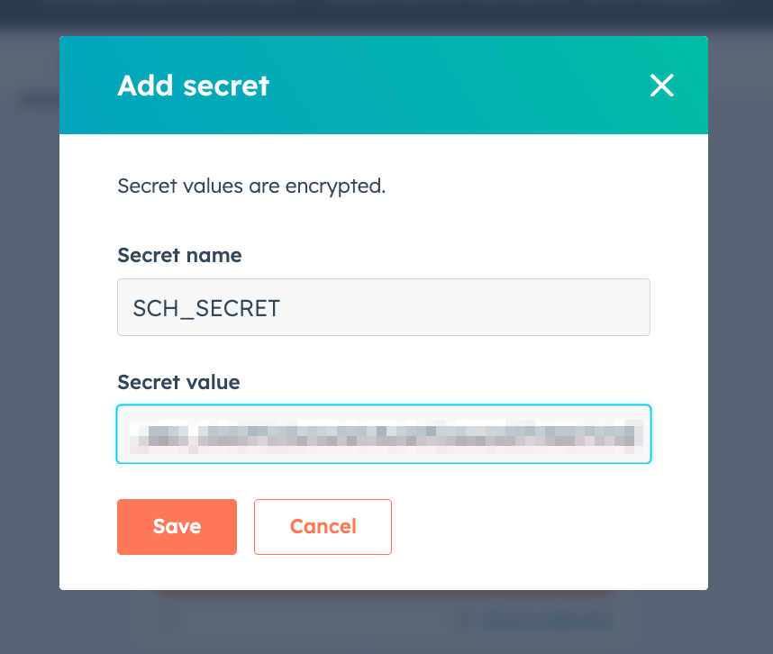

The following guide walks through how to set up a Hubspot Workflow to communicate with the Schematic API in order to:
* Create new companies or users
* Create and update company or user traits

## Create a Workflow

Navigate to Automations and select Workflows. In the Create Workflow dropwdown select From scratch.


Create a blank workflow that is Company based.

## Configure a custom code action

Click the + sign to add an action. Select Data ops and Custom code to create a new action.


Make sure Python 3.9 is selected as the language for this guide. In the Secrets dropdown, select Add secret.

Name the secret SCH_SECRET, and, in another tab, [get your secret key from Schematic](/quickstart#create-an-api-key).



Map the Record ID, Company Name, and Company Domain to properties within the action.


Copy the code below into the Code section to communicate with the Schematic ```/companies``` endpoint.

```
import os
import requests
import json

def main(event):
  
  url = 'https://api.schematichq.com/companies'
  
  company_body_payload = {"keys": {"id": event.get('inputFields').get('hs_object_id') },"name": event.get('inputFields').get('name'),"traits": {"website": event.get('inputFields').get('domain')}}
  
  print(company_body_payload)
  
  headers = {"X-Schematic-Api-Key":os.getenv('SCH_SECRET'), "Content-Type": "application/json"}
    
   # Request
  api_response = requests.post(url, data=json.dumps(company_body_payload), headers=headers)
  output = json.loads(api_response.text) 
  print (output) 
  
  # Return the output data that can be used in later actions in your workflow.
  return {
    "outputFields": {

    }
  }
```

## Test connection with Schematic

Once the action is configured, expand the Test action section, select a company, then click Test.

If the call is successful, Hubspot should show a Success status and the response from Schematic.


You can also check Schematic to ensure the company was created.


If the API call is working as expected, we can now customize the flow in a variety of ways to retrieve additional values from Hubspot, to trigger based on activity (e.g. a closed won deal), or to generate requests against other Schematic endpoints (e.g. /users).