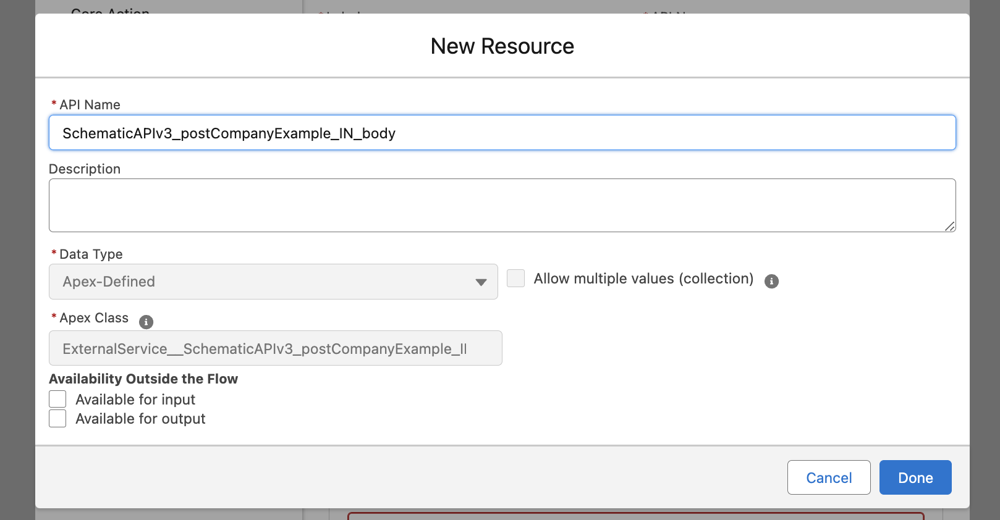

The following guide walks through how to set up an HTTP Callout Action within Flow Builder to communicate with the Schematic API in order to:
* Create new companies or users
* Create and update company or user traits

## Configure Salesforce to communicate with the Schematic API

From Setup, follow this guide to create a permission set, external credential, and named credential, in that order. Salesforce requires each of these objects to be configured to authenticate and communicate with external APIs from a given user.


### Create and assign a permission set

Navigate to Permission Sets and click New to create a new permission set. Add a label that describes the purpose, such as "API Callout to Schematic".

Once created, click on "Manage Assignments" and add assign to a user.

### Create an external credential

Navigate to Named Credentials and click on External Credentials on the setup page.

Create a new external credential with a label such as ```schematic_credential``` (mirror the same in the name field). Select "No Authentication" in the Authentication Protocal dropdown (we will define an API key in the header of the Named Credential).


Once the external credential is created, we need to create a Principal to assign user permissions to. Scroll down to the Principals section and select New. Fill in the information and assign the sequence number as 1.


Finally, we need to add a Permission Set Mapping to the principal. Navigate back to Permission Sets, select the permission set we created earlier, and find the menu option for External Credential Principal Access.


Under External Credential Principal Access, select Edit. Find the principal we created under Available External Credential Principals and add so that it is under the Enabled External Credential Principals.

### Create a named credential

Next, we're going to create a Named Credential, which defines the name and URL endpoint that will be referenced by our HTTP Callout. 

This is separate from an external credentials because often APIs have multiple endpoints that are addressed with the same authentication, for example, calendar.google.com/api and drive.google.com/api.

Click on Named Credentials on the setup page.


Create a new namaed credential with a label such as ```schematic``` (mirror the same in the name field). In the URL field, input ```https://api.schematichq.com``` and make sure "Enabled for Callouts" is selected.

In the External Credentials dropdown select the credentials we created earlier (the certificate is not necessary).

We will need to generate an authorization header to include our API key from Schematic, so ensure that is checked.

Save the named credential.

Once it is created, ensure the options look correct.


Scroll down to Custom Headers and select New. Define two key value pairs:
* X-Schematic-Api-Key ... ```you-api-secret-key```
* Content-Type ... application/json


If you don't already have a Schematic API key, [create one](/quickstart#create-an-api-key)

## Build a Flow

In this example, we will set up a flow to create a new company in Schematic.

From Setup, navigate to Flows.

### Create a flow in Flow Builder

Select New Flow. For the purpose of this guide, we will select Screen Flow so that debugging is easier.


Name and save the flow.

### Configure an HTTP Callout

Add an Action Element, then select HTTP Callout. Name the action and select the named credential that was created above.


On the next screen in the wizard, label the action as PostCompany with a method of POST (if we were retrieving information from Schematic, we would set the method to GET). Add a short description if desired.


Set the URL path to [/companies](../api-reference/companies/create-company.mdx), which corresponds to the endpoint to create and update companies. Use the following sample request in the Sample Request section (for other endpoints, refer to the [API Reference](/api-reference)).

```
{
  "keys": {
  	"salesforce_account_id": 123456789
  	},
  "traits": {
  	"name": "Acme Inc.",
  	"domain": "www.acme.org",
  	"status": "Customer",
  	"number_of_users": 3
  }
}
 ```


We can define more than one key, as long as it uniquely corresponds to a given company in Schematic. In this case, we're using the Salesforce Account ID that we will find on the Account object.

We can also define more than one trait, as we've done here. Traits do not need to be unique to a given company in Schematic, and can be pulled from any object in Salesforce. In this case, we're added a number of sample traits that might be found at the Account level.

If the Data Structure looks correct, select Done.

Click on Sample Response and copy the response [here](../api-reference/companies/create-company.mdx) for 201s (copied below).

```
{
  "data": {
    "created_at": "string",
    "environment_id": "string",
    "id": "string",
    "keys": [
      {
        "created_at": "string",
        "definition_id": "string",
        "entity_id": "string",
        "entity_type": "string",
        "environment_id": "string",
        "id": "string",
        "key": "string",
        "updated_at": "string",
        "value": "string"
      }
    ],
    "last_seen_at": "string",
    "name": "string",
    "traits": {
    },
    "updated_at": "string"
  },
  "params": {
  }
}
```

Click Review and confirm the Data Structure looks correct.

Save the HTTP Callout. In the New Action Modal, we will be prompted to add a label and API name, then set the request body.

In the dropdown click "New Resource" and name the resource based on the auto-selected Apex Class (follow the same format). The Data Type and Apex Class should be grayed out like below.



Click Done.

### Assign variables

Add an Assignment element prior to the HTTP Callout in the flow to assign values to the variables from the sample request. Map each variable from the sample request.


In this example, we'll use static values, but we can also reference objects within Salesforce to assign values dynamically if we retreive them prior to assignment in the Flow Builder. 

### Test the connection with Schematic

Add a Screen element after the HTTP Callout action in the Flow to observe output.

In the Screen element, select Display text, then add the output from the HTTP callout.


After saving the Flow, click Run. Salesforce will open a new tab with the API response. If the API call was invalid, the response will include the error code.


You can also check Schematic to ensure the company was created.


If the API call is working as expected, we can now customize the flow in a variety of ways to retrieve dynamic values from Salesforce, to trigger based on activity (e.g. a closed won deal), or to generate requests against other Schematic endpoints (e.g. /users).