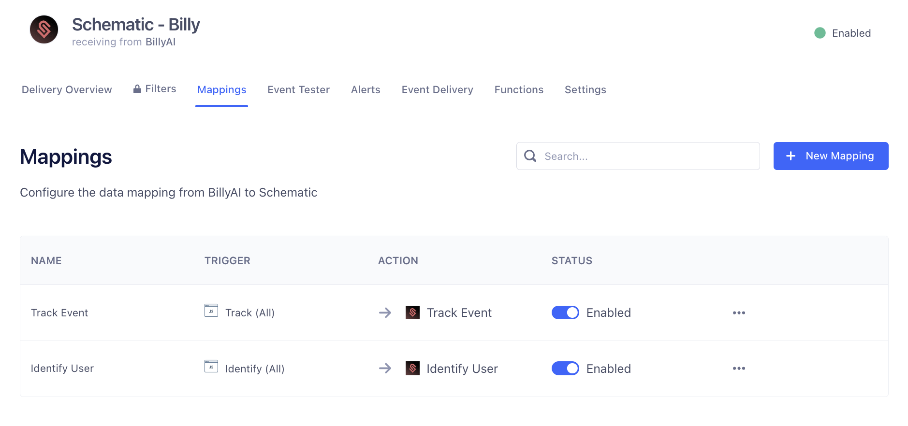

Segment is the easiest way to send events from your application to Schematic. If you already have Segment up and running in your application, Schematic recommends this approach so you don’t have to implement any additional code.

Why use the integration?
- Keep user and company profiles up to date with the latest context
- Set up and enforce metered features
- Track usage of your product across your customer base
- Use traits and usage in plan audiences and in rule-based targeting for flags

## Getting started
1. From your Segment web app, navigate to **Connections > Catalog > Destinations**.
2. Search for Schematic, select the Schematic destination, and click **Add destination**.
3. Select the source that will send data to Schematic, give your destination a name, then click **Create destination**.
4. On the destination’s Settings tab, input your Schematic API Key. To generate an API key, navigate to your Schematic workspace settings under **Settings > API Keys**.

Once you’ve connected Schematic to Segment, you can configure how you want to send data to Schematic in the Schematic destination’s **Mappings** tab.

You can read more about the Schematic destination [here](https://segment.com/docs/connections/destinations/catalog/actions-schematic/).

## Additional Context

Schematic only accepts Track event names that contain alphanumeric characters, dashes, and underscores. If your Segment event names have other characters, like spaces, the Schematic destination automatically snake_cases the event name before passing to Schematic. Segment passes the raw event name as an event trait.