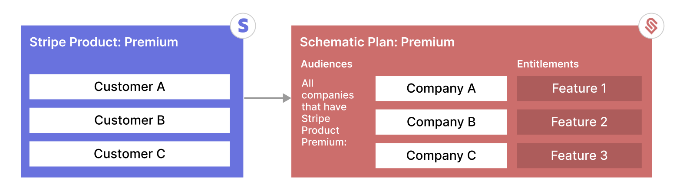
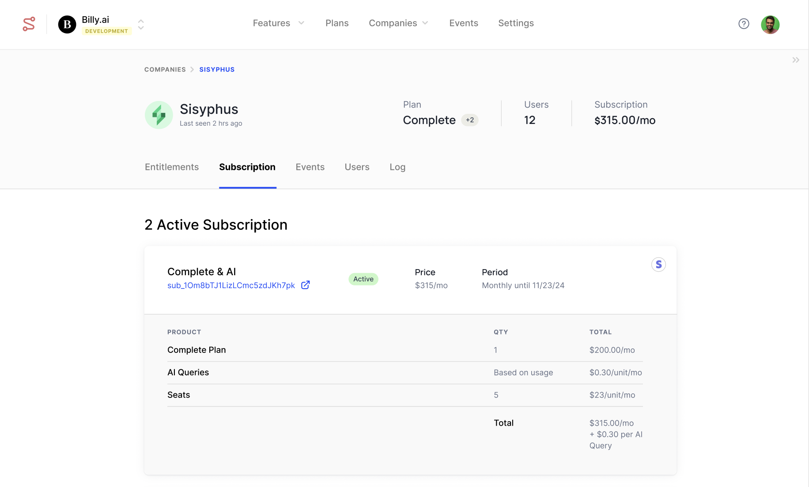
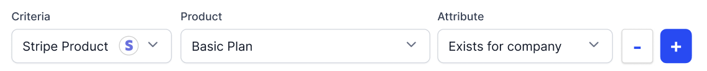

The Stripe integration for Schematic allows you to sync billing data from Stripe and map it to company profiles in Schematic. This provides a complete company view, showing not only product access and feature usage, but also subscription-level data.

The integration allows you to use data from Stripe to define plan audiences and flag rules. For example, you can create an audience of all companies subscribed to your "Premium" plan in Stripe. All companies subscribed to Premium in Stripe will then get the correct entitlements in your product.

Why use the integration?
- See a unified company profile combining account, usage, and billing data in one place
- Use existing billing data to directly assign entitlements to your customers
- Manage customer lifecycle automatically - when a subscription changes, entitlements will change via Schematic
## Example

1. In Stripe, there is a "Premium" product.
2. Companies A, B, and C are subscribed to the Premium product.
3. In Schematic, there is a "Premium" plan containing premium entitlements like Feature 1, 2, 3.
4. The Schematic plan is mapped to the Stripe Premium product through a plan audience (e.g. "All companies with 'Premium' product").
5. Companies A, B, and C are granted the entitlements associated with the "Premium" plan because of their Stripe subscription.

## Getting started

### Prerequisites

1. **Stripe Account** - You must have a Stripe account.
2. **Schematic Company Identifiers** - Each company you want to map must have a `stripe_customer_id` key in Schematic that corresponds to a `Customer ID` found in Stripe.

### Connecting Stripe to Schematic

1. In Schematic, go to **Settings > Stripe integration**.
2. Grab your API key from Stripe by going to **Developers > API Keys** (link [here](https://dashboard.stripe.com/apikeys)).
3. Go back to Schematic and input your Stripe API key to authenticate and connect your Stripe account with Schematic.

Once connected, Schematic will begin syncing subscription data.

### Viewing Subscription Data

For companies in Schematic that have an associated Stripe subscription, you can view that data in the **Subscription** tab within a company profile. Data will include:
- Products & quantities
- Quantities and rates
- Discounts/coupons that are applied to the subscription
- Term
- Subscription status

### Using within Flag Rules and Plan Audiences

You can use subscrition data as criterion when building plan audiences or flag rules in Schematic. This allows you to clearly align what a customer is billed with what they have access to within your application.

## Additional context

The Stripe integration is environment-scoped, so you can have a separate connection in each Schematic environment.

The initial reelase supports the use of basic subscription-level data for rule-based targeting. More billing data, e.g. product quantities and billing amounts, will be supported in future releases.c