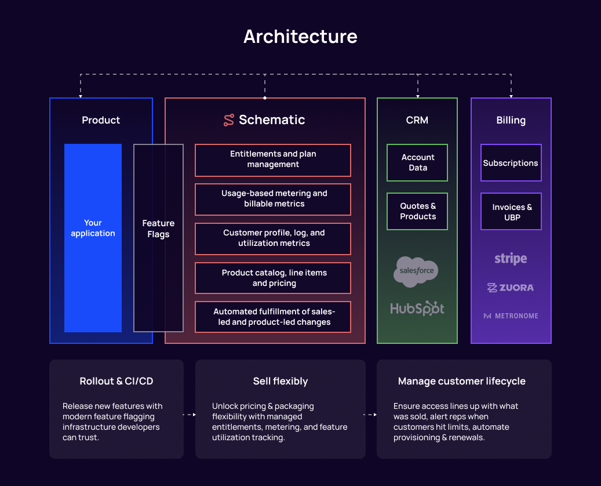
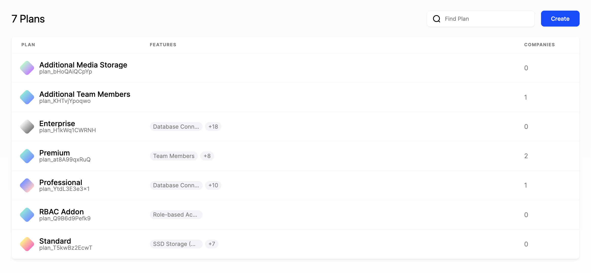
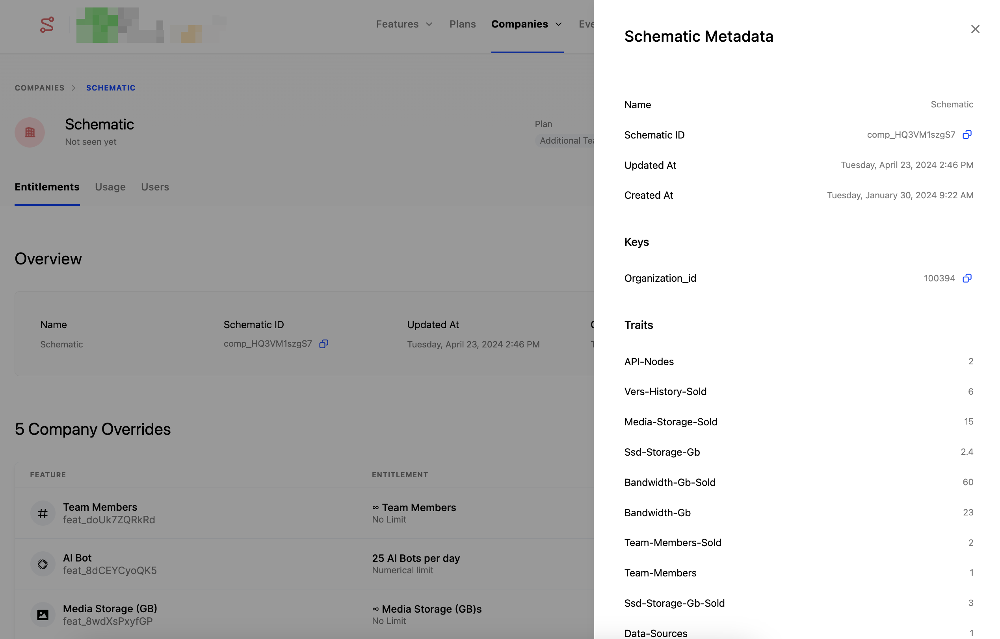
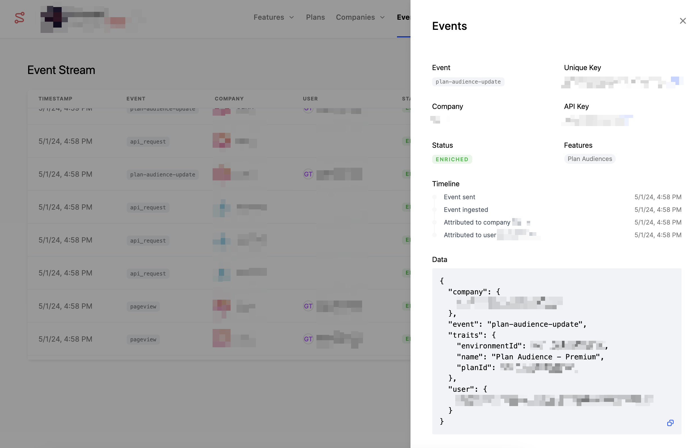
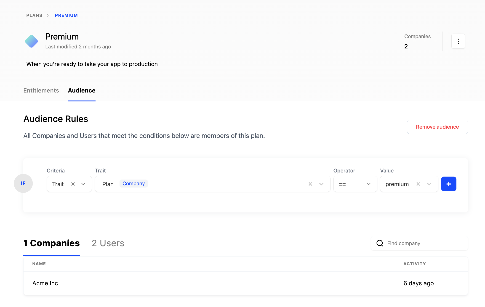
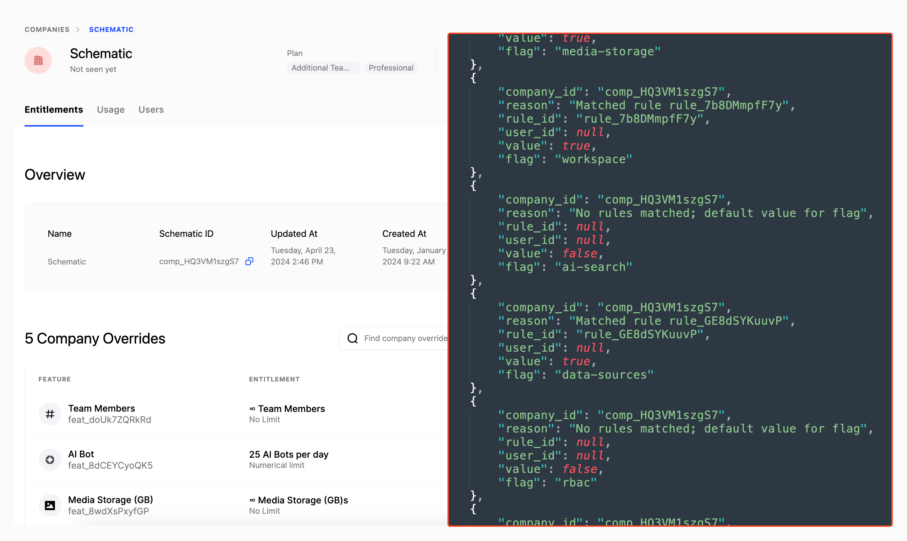

Schematic is a feature management platform that extends from deployment all the way through monetization. 

We believe that B2B businesses should not reinvent the wheel to support pricing and packaging, and that a single platform, not a collection of disconnected code, tools, and processes, should support customers from purchase to feature delivery and ultimately billing.

With Schematic, teams can ship features faster, centralize data from tools such as CRMs and billing systems for precise targeting and state management, and define & enforce packaging all in one place.

## What can I do with Schematic?

- **Ship new features quickly and safely** - Use granular targeting to roll out individual or sets of features. Target complete profiles housed directly within Schematic.
- **Tie features to plans and customers** - Deploy any business model easily, with support for boolean or metered features. Group features into plans to reflect tiering, add-ons, and usage-based packaging.
- **Experiment, enable feature trials, and manage customer lifecycle** -  Empower product and success to manage per-customer overrides, and run packaging experiments with cohorts without custom code.
- **Marry account, usage, and billing data in one place** - Integrate once with Schematic and leverage our integrations with Segment, CRMs, and billing systems for the data you need to define and evaluate access.

## Major concepts

There are several major concepts built into Schematic. Together, they allow teams to solve for billing and entitlements needs from one flexible tool that fits a variety of customers, stacks, & processes as businesses grow.

You can read about these concepts in depth [here](https://schematichq.com/operate-pricing-packaging).

### Product Catalog

This describes a company's products (also known as SKUs or plans) and associated features. Products can describe platforms, tiers, or add-ons. The definition of features within a product includes default values for allocations or limits, and pricing (coming soon). 

This catalog can be referenced across systems to inform sales, marketing, support, and billing functions.

### Company Profiles

The Company Profile is a centralized record for company state, aggregating all relevant company traits, subscription details, and usage data into a single, coherent profile that can be leveraged across tools.

The profile is key-based and key uniqueness is enforced across profiles to prevent duplicates. Profiles can have multiple keys so any one key does not need to be replicated across systems.

Profiles and profile traits can be referenced in flag targeting and plan audiences.

### Metering

Metering is crucial for supporting usage-based models. Metered properties can be monetized or unmonetized (tracked for telemetry or enforcing a packaged limit).

A usage event can be attributed to companies, users, and features within Schematic, forming the basis for enforcement and insights into behavior.

### Subscriptions

Subscriptions are essentially a relationship between a plan in the Product Catalog and a Company Profile. This is intentionally rule-based in Schematic to handle exceptions.

A company may have more than one active subscription at any given time, which would result in a superset of entitlements among them.

### Flags

Flags dictate who gets access to what features or services based on their context, and how much of a particular feature they get. This ensures customers can access only the features they should have access to, which is crucial for trials, tiered services, and premium offerings.

Company access is driven by flag checks that occur at the feature level, informed by the parameters of a company’s subscription and other policy set up in Schematic.