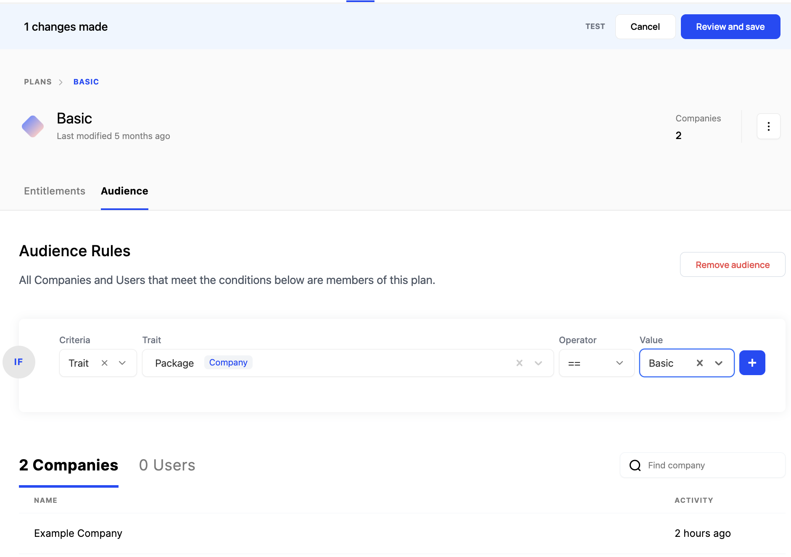

This guide will use the Python SDK where there are interactions with the Schematic API.

## Create environments and keys

### Setting up dev and prod environments

Manage and create new environments using the environment dropdown in the top right corner of Schematic. You can create API keys for each environment indpedently in Settings.


### Create an API key

Navigate to the API Keys section of your Settings page to generate your API keys. Once you create a key, an ID and a Secret will be generated. Make sure to store your Secret key in a secure place — Schematic will not display it again after it has been generated.


**Secret Keys** are used only for server-side integrations. These keys are meant to be confidential, so they should not be used on clients.

**Publishable Keys** are used in applications and websites to submit identify and track calls, as well as perform client-side feature evaluations. They can be embedded in your application and website.

All keys are environment scoped.

### Checking the Audit Log

You can view the Audit log [here](https://app.schematichq.com/settings/api-logs).


Within each request, you can view detail describing the response code, request ID, start/end times, the API key used, the method, the URL path, and the request & response payloads.

## Creating companies and users

Now that you have your Schematic account set up and you have an API key, let’s set up users and companies.

There are two methods to submit companies to Schematic:

- Sending Schematic identify calls
- Using the  company upsert endpoint

We’ll use the latter below method below.

1. **Create a new company**

Initialize the Python SDK and copy/paste the following:

```python
from schematic.client import Schematic

# initialize the client
client = Schematic(
    api_key = "your-api-key"
)

# create company in Schematic
response = client.companies.upsert_company(
    keys={
        "companyId":"FqaaszD"
    },
    name="Example Company",
    traits={
        "package":"Basic"
    }
)
```

<Info>  Schematic uses `keys` as unique identifiers for companies and users. You should populate this field with your own internal identifiers so that subsequent calls via the API referencing a given user or company can be done without having to persist Schematic IDs.</Info>

You should receive a response like this if the call was successful:

```json
{
    "data": {
        "created_at": "2024-05-17T19:26:52.933973Z",
        "entity_traits": [
            {
                "created_at": "2024-05-17T19:26:52.937330Z",
                "definition": {
                    "created_at": "2023-12-29T13:30:28.550833Z",
                    "display_name": "Package",
                    "entity_type": "company",
                    "hierarchy": [
                        "package"
                    ],
                    "id": "trt_1825bpc61gY",
                    "trait_type": "string",
                    "updated_at": "2023-12-29T13:30:28.550833Z"
                },
                "definition_id": "trt_1825bpc61gY",
                "environment_id": "env_W2KCnRmbjpN",
                "id": "etr_9aRxHj22b25",
                "updated_at": "2024-05-17T19:26:52.937330Z",
                "value": "Basic"
            }
        ],
        "environment_id": "env_W2KCnRmbjpN",
        "id": "comp_JaoafW2wqzL",
        "keys": [
            {
                "created_at": "2024-05-17T19:26:52.935538Z",
                "definition": {
                    "created_at": "2023-10-04T14:09:13.064812Z",
                    "entity_type": "company",
                    "id": "ekt_hfBCRsZPDPJ",
                    "key": "account_id",
                    "updated_at": "2023-10-04T14:09:13.064812Z"
                },
                "definition_id": "ekt_hfBCRsZPDPJ",
                "entity_id": "comp_JaoafW2wqzL",
                "entity_type": "company",
                "environment_id": "env_W2KCnRmbjpN",
                "id": "ekey_K1BE6MTTH9c",
                "key": "account_id",
                "updated_at": "2024-05-17T19:26:52.935538Z",
                "value": "FqaaszD"
            }
        ],
        "last_seen_at": null,
        "logo_url": null,
        "name": "Example Company",
        "plans": [],
        "traits": {
            "package": "Basic"
        },
        "updated_at": "2024-05-17T19:26:52.933973Z",
        "user_count": 0
    },
    "params": {}
}
```

1. **Confirm the company appears in the Schematic app**

Navigate to the [Companies](https://app.schematichq.com/companies) tab and search for "Example Company" to see the company in Schematic.


## Sending track and identify calls

Next, let’s start sending Schematic events from your application.

Events are useful for a variety of use cases in Schematic:

- To keep user and company profiles up to date with the latest context
- To set up and enforce metered features
- To track usage of your product across your customer base
- To use context sent via events in plan audiences and in rule-based targeting for flags

If you use Segment already, you can set up [the Schematic destination](integrations/segment.mdx). If you do not, you can instrument events directly in your application.

1. **Add the Javascript library to your application**

Follow the guide to install the client-side Javascript library [here](https://docs.schematichq.com/developer_resources/sdks/javascript).

<Info>Schematic supports several SDKs. Check them out [here](/developer_resources/sdks).</Info>

1. **Create a new event**

Let’s go ahead and instrument an identify call.

```jsx
const userId = "riF3NyX";
const userName = "Example User"

const keys = {
  userId: userId
};

const traits = {
  package: "Basic",
  company: "Example Company"
};

const company = {
  keys: {
    companyId: "FqaaszD"
  }
};

schematic.identify({ name: userName, keys, traits, company });
```

Identify calls are upserts, so any subsequent call using the same `keys` will update the associated user and company records rather than create entirely new ones. Additionally, you may use any data sent via these calles in plan audiences or flag rules.

Let’s send in a track call, as well.

```jsx
const eventName = "query";

const traits = {
};

const companyObject = {
  companyId: "FqaaszD"
};

const userObject = {
  userId: "riF3NyX"
}

schematic.track({
  event: eventName,
  traits: {
  },
  company: companyObject,
  user: userObject
});
```

Track calls can be associated with Companies, Users, and Features by specifying each when submitting a request to Schematic.

2. **Confirm the events was created in Schematic** 

Navigate to the [Events](https://app.schematichq.com/events) tab to verify your calls was successfully registered in your Schematic account.


## Creating features

Once we have companies and events flowing into Schematic, the next step is to add features to Schematic. Let’s add one in Schematic: Search Queries.

<Info>You can [create features via our API](api-reference/features/feature.mdx) as well</Info>

1. **Create a new feature in Schematic**

On the main [dashboard](https://app.schematichq.com/features), click “Create”. In the modal, add a name, description, and pick the event-based feature type.


<Info>You can choose between Boolean, Event-based, or Trait-based feature types.</Info>

1. **Define a flag key**

You’ll use this key in your application to reference this feature.


1. **Attach an event to the feature**

Add the `query` event to meter the feature and measure feature usage.


## Creating a plan and adding entitlements

Plans describe groups of entitlements. Let’s walk through creating one. Navigate to the plans tab and click “Create".

1. **Create a plan**

Add name and a description.


2. **Add an entitlement to the plan**

Click **Add Feature** to add an entitlement and specify the limit for Search Query for the Basic plan.

Event-based features can have no limit, some numerical limit that is static within a period, or a limit that is dynamic based on traits that exist at the company level (e.g. some allocation that was sold directly to a given company).


The Search Query feature can be added to other plans created in this account if we were to create them, and in each plan it may be entitled differently than the Basic plan.

3. **Target companies with an plan audiences**

Let’s set up an audience in the **Audience** tab to add [the company we created earlier](/quickstart#creating-companies-and-users) to the Basic plan so that it receives all entitlements associated with the plan.

In the plan audience, we're referring to a trait created at the company level for this audience, `Package`. Audience conditions can be logical ORs or ANDs if they have multiple conditions.



Only Example Company exists within our account, and it matches the condition in the audience. Once we click **Review and Save**, Example Company will receive all of the entitlements in the Basic plan.

## Evaluating entitlements

Finally, let’s check the entitlements for Example Company. 

The flag check is the main point of integration between Schematic and your application, and all of the rules set up above are accessed via this simple interface so that none of it has to live in your application.

1. **Check entitlements**

The only context you need to evaluate entitlements from your application is the key you passed earlier when you created “Example Company”. You do not need to store any data about products, features, or rules.

<Info>checkFlags accepts any key that you submit when you upsert companies.</Info>

Use the following code to perform a bulk flag check.

```python
from schematic.client import Schematic

# initialize the client
client = Schematic(
    api_key = "your-api-key"
)

# build context to reference company
company_context = {
    "account_id":"123456"
}

# request latest flag evaluation from Schematic based on rules in system
response = client.features.check_flags(
    company=company_context,
)
```

You should receive a response like the below if the call was successful that returns all flags defined in your Schematic instance (in this case, there is only one), including which entitlements the company should be granted access to. Example Company should be granted access to `search-queries` because the value that is returned is `true`.

<Info>For metered features, Schematic keeps track of consumption and limits and returns false when a company has surpassed a limit</Info>

```json
{
    "data": {
        "flags": [
						{
                "company_id": "comp_JaoafW2wqzL",
                "flag": "search-queries",
                "reason": "Matched rule rule_UG7yHTc86i1",
                "rule_id": "rule_UG7yHTc86i1",
                "user_id": null,
                "value": true
            }
        ]
    },
    "params": {}
}
```

## Additional context

A few things to note about how flag checks are evaluated:

- Companies can be associated with multiple plans as long as they match the plan audience conditions.
- If a company no longer meets the conditions of a plan audience, they will no longer be associated with the corresponding plan and lose the respective entitlements.
- Companies may have explicit entitlements that are described as "Company overrides" (not covered in this guide but can be configured on an individual company page)
- Schematic employs a permissive flag evaluation model -- in other words, if a company has entitlements, overrides, and individual flag targeting that conflict, the most permissive will prevail in the respective level.